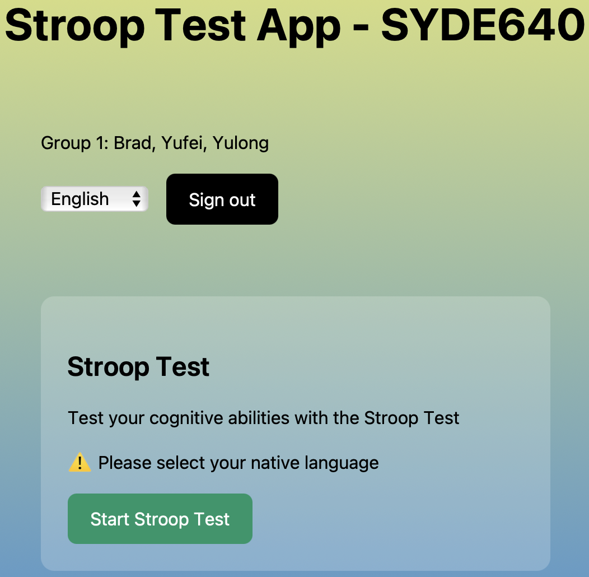

# Stroop Test Application with AWS Amplify

> Try it now: [Stroop Test App](https://public.ds0t19nwq4vif.amplifyapp.com)

This application is a full-stack Next.js implementation of the Stroop Test, integrated with AWS Amplify for backend services. The Stroop Test is a widely used psychological test that measures cognitive abilities and response times.

## Features

### Core Functionality
- **Stroop Test Implementation**
  - Practice round with all words displayed in black color
  - Test round with mismatched colors and words
  - Response time measurement
  - Comprehensive result analysis
  - Background music options during the test
  - Multi-language support (English, Chinese, French)

### Technical Features
- **Authentication**: Secure user authentication via Amazon Cognito
- **Data Storage**: Real-time data persistence with AWS AppSync and DynamoDB
- **CI/CD Pipeline**: Automated deployment pipeline with AWS Amplify
- **Internationalization**: Support for multiple languages
- **Error Handling**: data validation and performance monitoring

## Architecture

### Technology Stack
- Frontend: Next.js (Pages Router)
- Backend: AWS Amplify
- Authentication: Amazon Cognito
- Database: Amazon DynamoDB
- API: AWS AppSync (GraphQL)
- Lambda: Auto-generated resolvers and infrastructure management
- Storage: Amazon S3 for GraphQL codegen artifacts
- Styling: Custom CSS

### System Architecture

#### Complete Technology Stack Flow


#### Authentication Flow


#### Stroop Test Data Flow


#### Deployment Flow


## Features Preview

### Authentication
<div>
  
</div>

### Homepage Interface
<div>
  
</div>

### Test Interface
<div>
  
</div>

### Amplify Console
<div>
  
</div>

## Getting Started

### Local Development
1. Clone the repository
```bash
git clone <repository-url>
cd <project-directory>
```

2. Install dependencies
```bash
npm install
```

3. Configure local development environment:
   - Download `amplify_outputs.json` from your AWS Amplify Console
   - Place it in the root directory of your project
   - In a new terminal, start the Amplify sandbox:
```bash
npx ampx sandbox
```

4. Start the development server
```bash
npm run dev
```

> Note: The application will be available at http://localhost:3000

### Deployment
For detailed instructions on deploying your application, refer to the [deployment section](https://docs.amplify.aws/nextjs/start/quickstart/nextjs-pages-router/#deploy-a-fullstack-app-to-aws) of our documentation.

## Contributing
Please read [CONTRIBUTING.md](CONTRIBUTING.md) for details on our code of conduct and the process for submitting pull requests.

## License
This project is licensed under the MIT-0 License - see the [LICENSE](LICENSE) file for details.

